Statistical analyses
================
Matthias Urban
13 März, 2021

# Overview

This document describes the procedures for fitting, running, and
assessing the Bayesian Mixed Effects Logistic Regression Models.

# Required packages

``` r
library(tidyverse)
require(brms)
```

# Data preparation

Load in datasets

``` r
languagesonlandmasswithmountains <- read.csv("../Data/languagesonlandmasswithmountains.csv", header = T, encoding = "UTF-8")
languagesonlandmasswithhighmountains <- read.csv("../Data/languagesonlandmasswithhighmountains.csv", header = T, encoding = "UTF-8")
```

Treat Macroareas as factors

``` r
languagesonlandmasswithmountains$Macroarea <- as.factor(languagesonlandmasswithmountains$Macroarea)
languagesonlandmasswithhighmountains$Macroarea <- as.factor(languagesonlandmasswithhighmountains$Macroarea)
```

Log 10 transform of predictors after adding a constant to reduce skew

``` r
languagesonlandmasswithmountains <- mutate(languagesonlandmasswithmountains, Family_ID = ifelse(Family_ID == "", Name, Family_ID))
languagesonlandmasswithmountains <- mutate(languagesonlandmasswithmountains, Distancetosealog10 = log10(Distancetosea + 0.001))
languagesonlandmasswithmountains <- mutate(languagesonlandmasswithmountains, Distancetomountainlog10 = log10(Distancetomountain + 0.001))

languagesonlandmasswithhighmountains <- mutate(languagesonlandmasswithhighmountains, Family_ID = ifelse(Family_ID == "", Name, Family_ID))
languagesonlandmasswithhighmountains <- mutate(languagesonlandmasswithhighmountains, Distancetosealog10 = log10(Distancetosea + 0.001))
languagesonlandmasswithhighmountains <- mutate(languagesonlandmasswithhighmountains, Distancetohighmountainlog10 = log10(Distancetohighmountain + 0.001))
```

Set priors

``` r
priorshighmountains <- set_prior("normal(0, 2)", class = "b", coef = c("Distancetosealog10", "Distancetohighmountainlog10"))
priorsmountains <- set_prior("normal(0, 2)", class = "b", coef = c("Distancetosealog10", "Distancetomountainlog10"))
```

Then we set the area for the five New Zealand languages in the dataset
(the only ones remaining for the Papunesia area) to NA

``` r
languagesonlandmasswithhighmountains[which(languagesonlandmasswithhighmountains$Macroarea == "Papunesia"), "Macroarea"] <- NA
languagesonlandmasswithhighmountainsmodeling <- drop_na(languagesonlandmasswithhighmountains, Macroarea)
```

# Main analysis

``` r
isolatesnarrowhighmountainslog10model <- brm(IsolateNarrow ~ Distancetosealog10 * Distancetohighmountainlog10 + (1 + (Distancetosealog10 * Distancetohighmountainlog10) | Macroarea), family = "bernoulli", data = languagesonlandmasswithhighmountainsmodeling, warmup = 2000, iter = 3000, chains = 4, prior = priorshighmountains, seed = 68, control = list(adapt_delta = 0.999999, max_treedepth = 20))
```

Model assessment and checks

check Rhat and ESS values

``` r
summary(isolatesnarrowhighmountainslog10model)
```

    ##  Family: bernoulli 
    ##   Links: mu = logit 
    ## Formula: IsolateNarrow ~ Distancetosealog10 * Distancetohighmountainlog10 + (1 + (Distancetosealog10 * Distancetohighmountainlog10) | Macroarea) 
    ##    Data: languagesonlandmasswithhighmountainsmodeling (Number of observations: 5246) 
    ## Samples: 4 chains, each with iter = 3000; warmup = 2000; thin = 1;
    ##          total post-warmup samples = 4000
    ## 
    ## Group-Level Effects: 
    ## ~Macroarea (Number of levels: 4) 
    ##                                                                                 Estimate
    ## sd(Intercept)                                                                       2.12
    ## sd(Distancetosealog10)                                                              0.65
    ## sd(Distancetohighmountainlog10)                                                     0.40
    ## sd(Distancetosealog10:Distancetohighmountainlog10)                                  0.16
    ## cor(Intercept,Distancetosealog10)                                                  -0.08
    ## cor(Intercept,Distancetohighmountainlog10)                                          0.11
    ## cor(Distancetosealog10,Distancetohighmountainlog10)                                 0.00
    ## cor(Intercept,Distancetosealog10:Distancetohighmountainlog10)                      -0.02
    ## cor(Distancetosealog10,Distancetosealog10:Distancetohighmountainlog10)             -0.02
    ## cor(Distancetohighmountainlog10,Distancetosealog10:Distancetohighmountainlog10)    -0.17
    ##                                                                                 Est.Error
    ## sd(Intercept)                                                                        1.27
    ## sd(Distancetosealog10)                                                               0.63
    ## sd(Distancetohighmountainlog10)                                                      0.46
    ## sd(Distancetosealog10:Distancetohighmountainlog10)                                   0.22
    ## cor(Intercept,Distancetosealog10)                                                    0.43
    ## cor(Intercept,Distancetohighmountainlog10)                                           0.44
    ## cor(Distancetosealog10,Distancetohighmountainlog10)                                  0.45
    ## cor(Intercept,Distancetosealog10:Distancetohighmountainlog10)                        0.44
    ## cor(Distancetosealog10,Distancetosealog10:Distancetohighmountainlog10)               0.45
    ## cor(Distancetohighmountainlog10,Distancetosealog10:Distancetohighmountainlog10)      0.47
    ##                                                                                 l-95% CI
    ## sd(Intercept)                                                                       0.24
    ## sd(Distancetosealog10)                                                              0.02
    ## sd(Distancetohighmountainlog10)                                                     0.01
    ## sd(Distancetosealog10:Distancetohighmountainlog10)                                  0.00
    ## cor(Intercept,Distancetosealog10)                                                  -0.82
    ## cor(Intercept,Distancetohighmountainlog10)                                         -0.75
    ## cor(Distancetosealog10,Distancetohighmountainlog10)                                -0.82
    ## cor(Intercept,Distancetosealog10:Distancetohighmountainlog10)                      -0.83
    ## cor(Distancetosealog10,Distancetosealog10:Distancetohighmountainlog10)             -0.84
    ## cor(Distancetohighmountainlog10,Distancetosealog10:Distancetohighmountainlog10)    -0.91
    ##                                                                                 u-95% CI
    ## sd(Intercept)                                                                       5.18
    ## sd(Distancetosealog10)                                                              2.29
    ## sd(Distancetohighmountainlog10)                                                     1.62
    ## sd(Distancetosealog10:Distancetohighmountainlog10)                                  0.73
    ## cor(Intercept,Distancetosealog10)                                                   0.75
    ## cor(Intercept,Distancetohighmountainlog10)                                          0.86
    ## cor(Distancetosealog10,Distancetohighmountainlog10)                                 0.82
    ## cor(Intercept,Distancetosealog10:Distancetohighmountainlog10)                       0.79
    ## cor(Distancetosealog10,Distancetosealog10:Distancetohighmountainlog10)              0.81
    ## cor(Distancetohighmountainlog10,Distancetosealog10:Distancetohighmountainlog10)     0.75
    ##                                                                                 Rhat
    ## sd(Intercept)                                                                   1.00
    ## sd(Distancetosealog10)                                                          1.00
    ## sd(Distancetohighmountainlog10)                                                 1.00
    ## sd(Distancetosealog10:Distancetohighmountainlog10)                              1.00
    ## cor(Intercept,Distancetosealog10)                                               1.00
    ## cor(Intercept,Distancetohighmountainlog10)                                      1.00
    ## cor(Distancetosealog10,Distancetohighmountainlog10)                             1.00
    ## cor(Intercept,Distancetosealog10:Distancetohighmountainlog10)                   1.00
    ## cor(Distancetosealog10,Distancetosealog10:Distancetohighmountainlog10)          1.00
    ## cor(Distancetohighmountainlog10,Distancetosealog10:Distancetohighmountainlog10) 1.00
    ##                                                                                 Bulk_ESS
    ## sd(Intercept)                                                                       1442
    ## sd(Distancetosealog10)                                                              1141
    ## sd(Distancetohighmountainlog10)                                                      811
    ## sd(Distancetosealog10:Distancetohighmountainlog10)                                   766
    ## cor(Intercept,Distancetosealog10)                                                   3394
    ## cor(Intercept,Distancetohighmountainlog10)                                          4373
    ## cor(Distancetosealog10,Distancetohighmountainlog10)                                 3127
    ## cor(Intercept,Distancetosealog10:Distancetohighmountainlog10)                       4277
    ## cor(Distancetosealog10,Distancetosealog10:Distancetohighmountainlog10)              3808
    ## cor(Distancetohighmountainlog10,Distancetosealog10:Distancetohighmountainlog10)     2831
    ##                                                                                 Tail_ESS
    ## sd(Intercept)                                                                        821
    ## sd(Distancetosealog10)                                                              1811
    ## sd(Distancetohighmountainlog10)                                                     1920
    ## sd(Distancetosealog10:Distancetohighmountainlog10)                                  1024
    ## cor(Intercept,Distancetosealog10)                                                   2398
    ## cor(Intercept,Distancetohighmountainlog10)                                          2889
    ## cor(Distancetosealog10,Distancetohighmountainlog10)                                 3167
    ## cor(Intercept,Distancetosealog10:Distancetohighmountainlog10)                       2896
    ## cor(Distancetosealog10,Distancetosealog10:Distancetohighmountainlog10)              3250
    ## cor(Distancetohighmountainlog10,Distancetosealog10:Distancetohighmountainlog10)     3159
    ## 
    ## Population-Level Effects: 
    ##                                                Estimate Est.Error l-95% CI
    ## Intercept                                         -2.99      1.33    -5.63
    ## Distancetosealog10                                 0.01      0.51    -0.84
    ## Distancetohighmountainlog10                       -0.13      0.31    -0.75
    ## Distancetosealog10:Distancetohighmountainlog10     0.04      0.16    -0.19
    ##                                                u-95% CI Rhat Bulk_ESS Tail_ESS
    ## Intercept                                         -0.08 1.00     1933     2386
    ## Distancetosealog10                                 1.19 1.00     1474     1158
    ## Distancetohighmountainlog10                        0.49 1.00     1805     1631
    ## Distancetosealog10:Distancetohighmountainlog10     0.44 1.00     1565      889
    ## 
    ## Samples were drawn using sampling(NUTS). For each parameter, Bulk_ESS
    ## and Tail_ESS are effective sample size measures, and Rhat is the potential
    ## scale reduction factor on split chains (at convergence, Rhat = 1).

Inspect chains

``` r
plot(isolatesnarrowhighmountainslog10model)
```

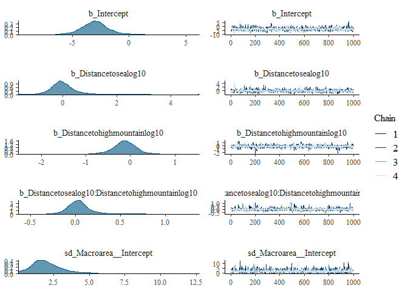<!-- -->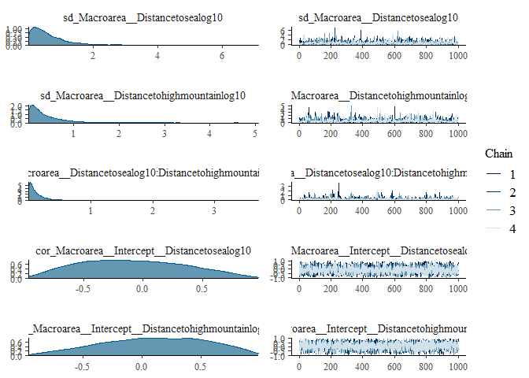<!-- -->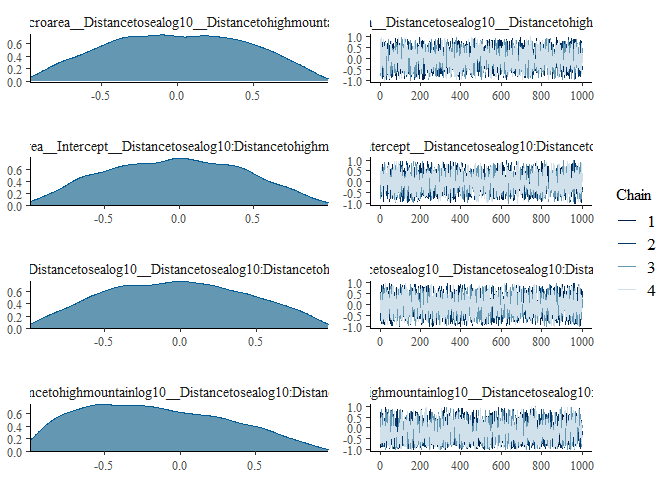<!-- -->
Inspect plots of observed data and posterior predictive samples

``` r
pp_check(isolatesnarrowhighmountainslog10model)
```

    ## Using 10 posterior samples for ppc type 'dens_overlay' by default.

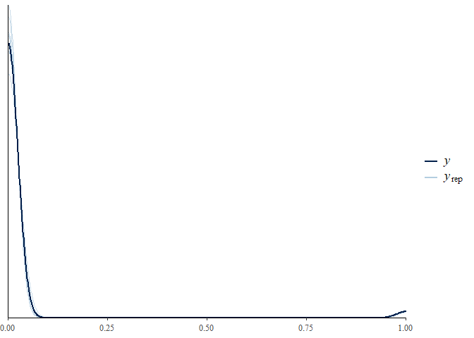<!-- -->

``` r
pp_check(isolatesnarrowhighmountainslog10model, type = "error_binned")
```

    ## Using 10 posterior samples for ppc type 'error_binned' by default.

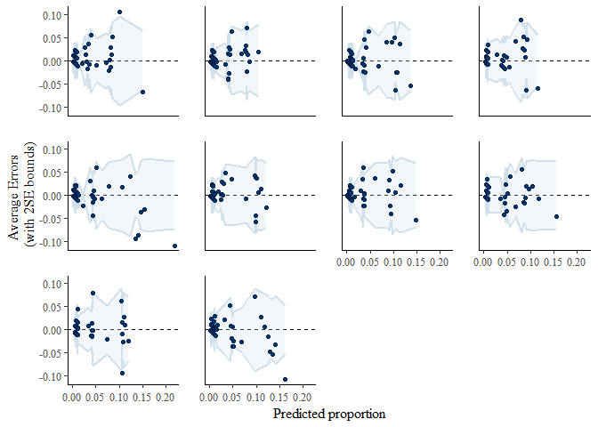<!-- -->
Assess predictive accuracy

``` r
isolatesnarrowhighmountainslog10model_pred <- predict(isolatesnarrowhighmountainslog10model, type = "response")[, "Estimate"]
isolatesnarrowhighmountainslog10model_pred <- as.numeric(isolatesnarrowhighmountainslog10model_pred > mean(languagesonlandmasswithhighmountainsmodeling$IsolateNarrow))
```

``` r
(classtab_isolatesnarrowhighmountainslog10model <- table(predicted = isolatesnarrowhighmountainslog10model_pred, observed = languagesonlandmasswithhighmountainsmodeling$IsolateNarrow))
```

    ##          observed
    ## predicted FALSE TRUE
    ##         0  3912   27
    ##         1  1213   94

``` r
(acc_isolatesnarrowhighmountainslog10model <- sum(diag(classtab_isolatesnarrowhighmountainslog10model)) / sum(classtab_isolatesnarrowhighmountainslog10model))
```

    ## [1] 0.7636294

# Ancillary analyses

## Bernoulli model for isolates in a wide sense and high mountain areas with log10 transformed predictors and random effect for macroarea

``` r
isolateswidehighmountainslog10model <- brm(IsolateWide ~ Distancetosealog10 * Distancetohighmountainlog10 + (1 + (Distancetosealog10 * Distancetohighmountainlog10) | Macroarea), family = "bernoulli", data = languagesonlandmasswithhighmountainsmodeling, warmup = 2000, iter = 3000, chains = 4, prior = priorshighmountains, seed = 2102, control = list(adapt_delta = 0.999999, max_treedepth = 20))
```

Model assessment and checks

check Rhat and ESS values

``` r
summary(isolateswidehighmountainslog10model)
```

    ##  Family: bernoulli 
    ##   Links: mu = logit 
    ## Formula: IsolateWide ~ Distancetosealog10 * Distancetohighmountainlog10 + (1 + (Distancetosealog10 * Distancetohighmountainlog10) | Macroarea) 
    ##    Data: languagesonlandmasswithhighmountainsmodeling (Number of observations: 5246) 
    ## Samples: 4 chains, each with iter = 3000; warmup = 2000; thin = 1;
    ##          total post-warmup samples = 4000
    ## 
    ## Group-Level Effects: 
    ## ~Macroarea (Number of levels: 4) 
    ##                                                                                 Estimate
    ## sd(Intercept)                                                                       2.38
    ## sd(Distancetosealog10)                                                              0.51
    ## sd(Distancetohighmountainlog10)                                                     0.42
    ## sd(Distancetosealog10:Distancetohighmountainlog10)                                  0.16
    ## cor(Intercept,Distancetosealog10)                                                  -0.18
    ## cor(Intercept,Distancetohighmountainlog10)                                          0.14
    ## cor(Distancetosealog10,Distancetohighmountainlog10)                                -0.04
    ## cor(Intercept,Distancetosealog10:Distancetohighmountainlog10)                      -0.09
    ## cor(Distancetosealog10,Distancetosealog10:Distancetohighmountainlog10)             -0.03
    ## cor(Distancetohighmountainlog10,Distancetosealog10:Distancetohighmountainlog10)    -0.21
    ##                                                                                 Est.Error
    ## sd(Intercept)                                                                        1.23
    ## sd(Distancetosealog10)                                                               0.50
    ## sd(Distancetohighmountainlog10)                                                      0.48
    ## sd(Distancetosealog10:Distancetohighmountainlog10)                                   0.20
    ## cor(Intercept,Distancetosealog10)                                                    0.42
    ## cor(Intercept,Distancetohighmountainlog10)                                           0.42
    ## cor(Distancetosealog10,Distancetohighmountainlog10)                                  0.46
    ## cor(Intercept,Distancetosealog10:Distancetohighmountainlog10)                        0.44
    ## cor(Distancetosealog10,Distancetosealog10:Distancetohighmountainlog10)               0.45
    ## cor(Distancetohighmountainlog10,Distancetosealog10:Distancetohighmountainlog10)      0.45
    ##                                                                                 l-95% CI
    ## sd(Intercept)                                                                       0.73
    ## sd(Distancetosealog10)                                                              0.02
    ## sd(Distancetohighmountainlog10)                                                     0.01
    ## sd(Distancetosealog10:Distancetohighmountainlog10)                                  0.01
    ## cor(Intercept,Distancetosealog10)                                                  -0.87
    ## cor(Intercept,Distancetohighmountainlog10)                                         -0.68
    ## cor(Distancetosealog10,Distancetohighmountainlog10)                                -0.85
    ## cor(Intercept,Distancetosealog10:Distancetohighmountainlog10)                      -0.84
    ## cor(Distancetosealog10,Distancetosealog10:Distancetohighmountainlog10)             -0.84
    ## cor(Distancetohighmountainlog10,Distancetosealog10:Distancetohighmountainlog10)    -0.91
    ##                                                                                 u-95% CI
    ## sd(Intercept)                                                                       5.55
    ## sd(Distancetosealog10)                                                              1.84
    ## sd(Distancetohighmountainlog10)                                                     1.72
    ## sd(Distancetosealog10:Distancetohighmountainlog10)                                  0.70
    ## cor(Intercept,Distancetosealog10)                                                   0.68
    ## cor(Intercept,Distancetohighmountainlog10)                                          0.84
    ## cor(Distancetosealog10,Distancetohighmountainlog10)                                 0.81
    ## cor(Intercept,Distancetosealog10:Distancetohighmountainlog10)                       0.75
    ## cor(Distancetosealog10,Distancetosealog10:Distancetohighmountainlog10)              0.81
    ## cor(Distancetohighmountainlog10,Distancetosealog10:Distancetohighmountainlog10)     0.72
    ##                                                                                 Rhat
    ## sd(Intercept)                                                                   1.00
    ## sd(Distancetosealog10)                                                          1.00
    ## sd(Distancetohighmountainlog10)                                                 1.00
    ## sd(Distancetosealog10:Distancetohighmountainlog10)                              1.00
    ## cor(Intercept,Distancetosealog10)                                               1.00
    ## cor(Intercept,Distancetohighmountainlog10)                                      1.00
    ## cor(Distancetosealog10,Distancetohighmountainlog10)                             1.00
    ## cor(Intercept,Distancetosealog10:Distancetohighmountainlog10)                   1.00
    ## cor(Distancetosealog10,Distancetosealog10:Distancetohighmountainlog10)          1.00
    ## cor(Distancetohighmountainlog10,Distancetosealog10:Distancetohighmountainlog10) 1.00
    ##                                                                                 Bulk_ESS
    ## sd(Intercept)                                                                       1597
    ## sd(Distancetosealog10)                                                              1527
    ## sd(Distancetohighmountainlog10)                                                      714
    ## sd(Distancetosealog10:Distancetohighmountainlog10)                                   919
    ## cor(Intercept,Distancetosealog10)                                                   2685
    ## cor(Intercept,Distancetohighmountainlog10)                                          3666
    ## cor(Distancetosealog10,Distancetohighmountainlog10)                                 3130
    ## cor(Intercept,Distancetosealog10:Distancetohighmountainlog10)                       3506
    ## cor(Distancetosealog10,Distancetosealog10:Distancetohighmountainlog10)              4020
    ## cor(Distancetohighmountainlog10,Distancetosealog10:Distancetohighmountainlog10)     2645
    ##                                                                                 Tail_ESS
    ## sd(Intercept)                                                                       1572
    ## sd(Distancetosealog10)                                                              2202
    ## sd(Distancetohighmountainlog10)                                                     1664
    ## sd(Distancetosealog10:Distancetohighmountainlog10)                                  1701
    ## cor(Intercept,Distancetosealog10)                                                   2675
    ## cor(Intercept,Distancetohighmountainlog10)                                          2661
    ## cor(Distancetosealog10,Distancetohighmountainlog10)                                 3037
    ## cor(Intercept,Distancetosealog10:Distancetohighmountainlog10)                       2504
    ## cor(Distancetosealog10,Distancetosealog10:Distancetohighmountainlog10)              3428
    ## cor(Distancetohighmountainlog10,Distancetosealog10:Distancetohighmountainlog10)     3220
    ## 
    ## Population-Level Effects: 
    ##                                                Estimate Est.Error l-95% CI
    ## Intercept                                         -2.61      1.39    -5.32
    ## Distancetosealog10                                -0.16      0.39    -0.84
    ## Distancetohighmountainlog10                       -0.10      0.31    -0.72
    ## Distancetosealog10:Distancetohighmountainlog10     0.06      0.14    -0.17
    ##                                                u-95% CI Rhat Bulk_ESS Tail_ESS
    ## Intercept                                          0.34 1.00     1746     2073
    ## Distancetosealog10                                 0.77 1.00     1877     1772
    ## Distancetohighmountainlog10                        0.59 1.00     1652     1425
    ## Distancetosealog10:Distancetohighmountainlog10     0.36 1.00     2001     1445
    ## 
    ## Samples were drawn using sampling(NUTS). For each parameter, Bulk_ESS
    ## and Tail_ESS are effective sample size measures, and Rhat is the potential
    ## scale reduction factor on split chains (at convergence, Rhat = 1).

Inspect chains

``` r
plot(isolateswidehighmountainslog10model)
```

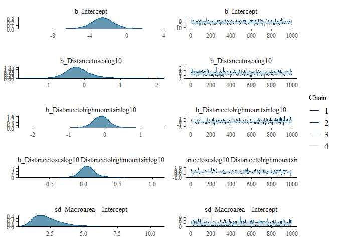<!-- -->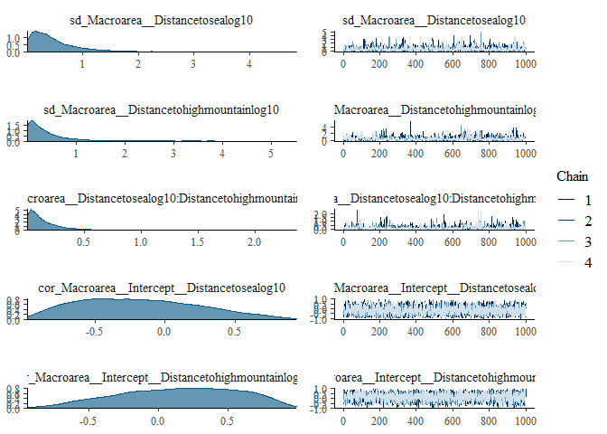<!-- -->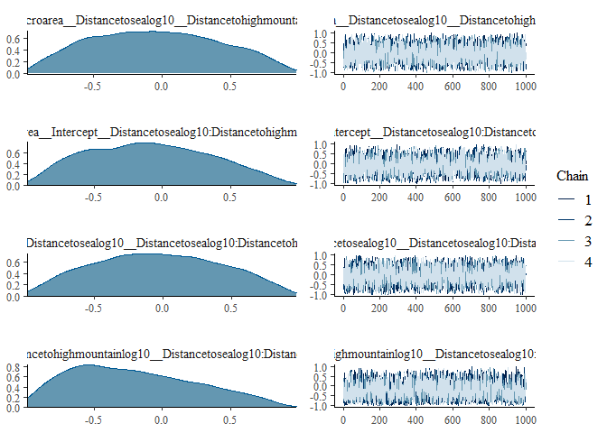<!-- -->
Inspect plots of observed data and posterior predictive samples

``` r
pp_check(isolateswidehighmountainslog10model)
```

    ## Using 10 posterior samples for ppc type 'dens_overlay' by default.

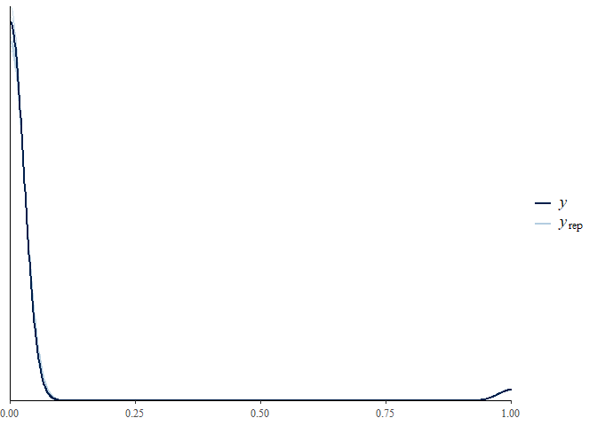<!-- -->

``` r
pp_check(isolateswidehighmountainslog10model, type = "error_binned")
```

    ## Using 10 posterior samples for ppc type 'error_binned' by default.

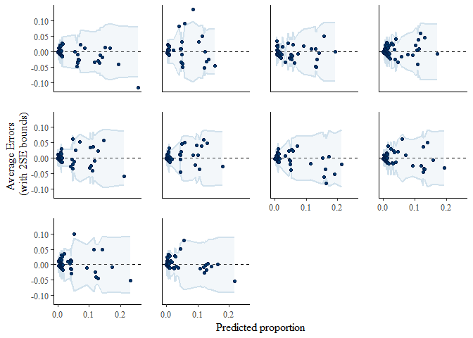<!-- -->
Assess predictive accuracy

``` r
isolateswidehighmountainslog10model_pred <- predict(isolateswidehighmountainslog10model, type = "response")[, "Estimate"]
isolateswidehighmountainslog10model_pred <- as.numeric(isolateswidehighmountainslog10model_pred > mean(languagesonlandmasswithhighmountainsmodeling$IsolateWide))
```

``` r
(classtab_isolateswidehighmountainslog10model <- table(predicted = isolateswidehighmountainslog10model_pred, observed = languagesonlandmasswithhighmountainsmodeling$IsolateWide))
```

    ##          observed
    ## predicted FALSE TRUE
    ##         0  3909   33
    ##         1  1188  116

``` r
(acc_isolateswidehighmountainslog10model <- sum(diag(classtab_isolateswidehighmountainslog10model)) / sum(classtab_isolateswidehighmountainslog10model))
```

    ## [1] 0.7672512

## Bernoulli model for isolates in a narrow sense and all mountainareas with log10 transformed predictors and random effect for macroarea

``` r
isolatesnarrowallmountainslog10model <- brm(IsolateNarrow ~ Distancetosealog10 * Distancetomountainlog10 + (1 + (Distancetosealog10 * Distancetomountainlog10) | Macroarea), family = "bernoulli", data = languagesonlandmasswithmountains, warmup = 2000, iter = 3000, chains = 4, prior = priorsmountains, seed = 2102, control = list(adapt_delta = 0.999999, max_treedepth = 20))
```

Model assessment and checks

check Rhat and ESS values

``` r
summary(isolatesnarrowallmountainslog10model)
```

    ##  Family: bernoulli 
    ##   Links: mu = logit 
    ## Formula: IsolateNarrow ~ Distancetosealog10 * Distancetomountainlog10 + (1 + (Distancetosealog10 * Distancetomountainlog10) | Macroarea) 
    ##    Data: languagesonlandmasswithmountains (Number of observations: 7117) 
    ## Samples: 4 chains, each with iter = 3000; warmup = 2000; thin = 1;
    ##          total post-warmup samples = 4000
    ## 
    ## Group-Level Effects: 
    ## ~Macroarea (Number of levels: 6) 
    ##                                                                         Estimate
    ## sd(Intercept)                                                               2.19
    ## sd(Distancetosealog10)                                                      0.71
    ## sd(Distancetomountainlog10)                                                 0.21
    ## sd(Distancetosealog10:Distancetomountainlog10)                              0.11
    ## cor(Intercept,Distancetosealog10)                                          -0.30
    ## cor(Intercept,Distancetomountainlog10)                                     -0.08
    ## cor(Distancetosealog10,Distancetomountainlog10)                             0.08
    ## cor(Intercept,Distancetosealog10:Distancetomountainlog10)                   0.15
    ## cor(Distancetosealog10,Distancetosealog10:Distancetomountainlog10)         -0.28
    ## cor(Distancetomountainlog10,Distancetosealog10:Distancetomountainlog10)    -0.25
    ##                                                                         Est.Error
    ## sd(Intercept)                                                                0.90
    ## sd(Distancetosealog10)                                                       0.39
    ## sd(Distancetomountainlog10)                                                  0.20
    ## sd(Distancetosealog10:Distancetomountainlog10)                               0.09
    ## cor(Intercept,Distancetosealog10)                                            0.36
    ## cor(Intercept,Distancetomountainlog10)                                       0.42
    ## cor(Distancetosealog10,Distancetomountainlog10)                              0.43
    ## cor(Intercept,Distancetosealog10:Distancetomountainlog10)                    0.38
    ## cor(Distancetosealog10,Distancetosealog10:Distancetomountainlog10)           0.42
    ## cor(Distancetomountainlog10,Distancetosealog10:Distancetomountainlog10)      0.45
    ##                                                                         l-95% CI
    ## sd(Intercept)                                                               0.98
    ## sd(Distancetosealog10)                                                      0.19
    ## sd(Distancetomountainlog10)                                                 0.01
    ## sd(Distancetosealog10:Distancetomountainlog10)                              0.01
    ## cor(Intercept,Distancetosealog10)                                          -0.86
    ## cor(Intercept,Distancetomountainlog10)                                     -0.81
    ## cor(Distancetosealog10,Distancetomountainlog10)                            -0.74
    ## cor(Intercept,Distancetosealog10:Distancetomountainlog10)                  -0.62
    ## cor(Distancetosealog10,Distancetosealog10:Distancetomountainlog10)         -0.91
    ## cor(Distancetomountainlog10,Distancetosealog10:Distancetomountainlog10)    -0.92
    ##                                                                         u-95% CI
    ## sd(Intercept)                                                               4.48
    ## sd(Distancetosealog10)                                                      1.69
    ## sd(Distancetomountainlog10)                                                 0.69
    ## sd(Distancetosealog10:Distancetomountainlog10)                              0.33
    ## cor(Intercept,Distancetosealog10)                                           0.49
    ## cor(Intercept,Distancetomountainlog10)                                      0.72
    ## cor(Distancetosealog10,Distancetomountainlog10)                             0.84
    ## cor(Intercept,Distancetosealog10:Distancetomountainlog10)                   0.81
    ## cor(Distancetosealog10,Distancetosealog10:Distancetomountainlog10)          0.62
    ## cor(Distancetomountainlog10,Distancetosealog10:Distancetomountainlog10)     0.70
    ##                                                                         Rhat
    ## sd(Intercept)                                                           1.00
    ## sd(Distancetosealog10)                                                  1.00
    ## sd(Distancetomountainlog10)                                             1.00
    ## sd(Distancetosealog10:Distancetomountainlog10)                          1.00
    ## cor(Intercept,Distancetosealog10)                                       1.00
    ## cor(Intercept,Distancetomountainlog10)                                  1.00
    ## cor(Distancetosealog10,Distancetomountainlog10)                         1.00
    ## cor(Intercept,Distancetosealog10:Distancetomountainlog10)               1.00
    ## cor(Distancetosealog10,Distancetosealog10:Distancetomountainlog10)      1.00
    ## cor(Distancetomountainlog10,Distancetosealog10:Distancetomountainlog10) 1.00
    ##                                                                         Bulk_ESS
    ## sd(Intercept)                                                               1999
    ## sd(Distancetosealog10)                                                      1577
    ## sd(Distancetomountainlog10)                                                  992
    ## sd(Distancetosealog10:Distancetomountainlog10)                              1104
    ## cor(Intercept,Distancetosealog10)                                           2853
    ## cor(Intercept,Distancetomountainlog10)                                      3591
    ## cor(Distancetosealog10,Distancetomountainlog10)                             3093
    ## cor(Intercept,Distancetosealog10:Distancetomountainlog10)                   4123
    ## cor(Distancetosealog10,Distancetosealog10:Distancetomountainlog10)          3014
    ## cor(Distancetomountainlog10,Distancetosealog10:Distancetomountainlog10)     2157
    ##                                                                         Tail_ESS
    ## sd(Intercept)                                                               2513
    ## sd(Distancetosealog10)                                                      1716
    ## sd(Distancetomountainlog10)                                                 1405
    ## sd(Distancetosealog10:Distancetomountainlog10)                              2028
    ## cor(Intercept,Distancetosealog10)                                           2803
    ## cor(Intercept,Distancetomountainlog10)                                      2808
    ## cor(Distancetosealog10,Distancetomountainlog10)                             3032
    ## cor(Intercept,Distancetosealog10:Distancetomountainlog10)                   2837
    ## cor(Distancetosealog10,Distancetosealog10:Distancetomountainlog10)          2761
    ## cor(Distancetomountainlog10,Distancetosealog10:Distancetomountainlog10)     2835
    ## 
    ## Population-Level Effects: 
    ##                                            Estimate Est.Error l-95% CI u-95% CI
    ## Intercept                                     -3.78      0.99    -5.66    -1.75
    ## Distancetosealog10                             0.18      0.34    -0.48     0.90
    ## Distancetomountainlog10                        0.17      0.18    -0.19     0.53
    ## Distancetosealog10:Distancetomountainlog10    -0.05      0.09    -0.22     0.12
    ##                                            Rhat Bulk_ESS Tail_ESS
    ## Intercept                                  1.00     1884     2259
    ## Distancetosealog10                         1.00     1885     2183
    ## Distancetomountainlog10                    1.00     2539     2163
    ## Distancetosealog10:Distancetomountainlog10 1.00     2182     2022
    ## 
    ## Samples were drawn using sampling(NUTS). For each parameter, Bulk_ESS
    ## and Tail_ESS are effective sample size measures, and Rhat is the potential
    ## scale reduction factor on split chains (at convergence, Rhat = 1).

Inspect chains

``` r
plot(isolatesnarrowallmountainslog10model)
```

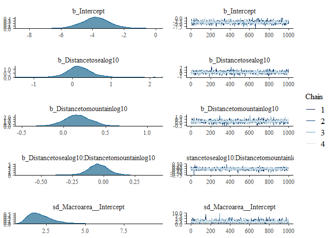<!-- -->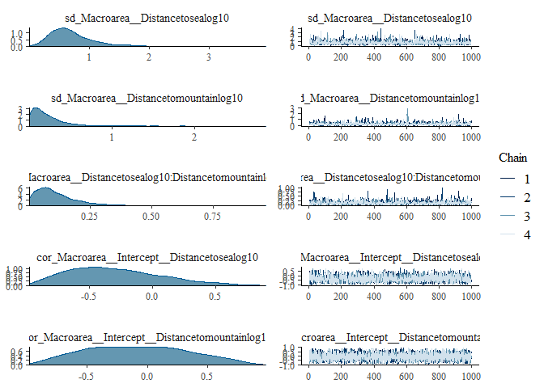<!-- -->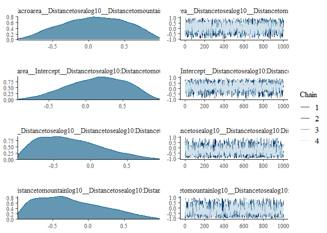<!-- -->
Inspect plots of observed data and posterior predictive samples

``` r
pp_check(isolatesnarrowallmountainslog10model)
```

    ## Using 10 posterior samples for ppc type 'dens_overlay' by default.

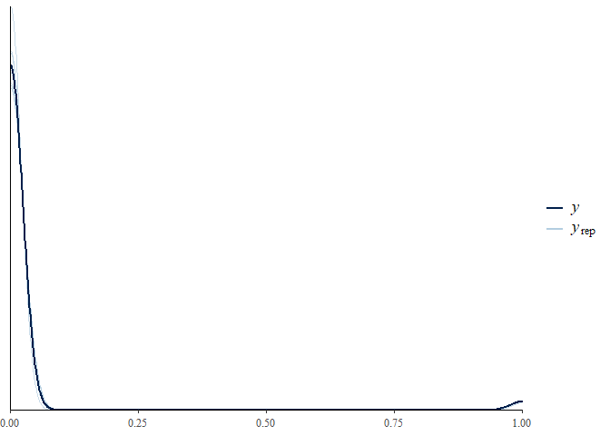<!-- -->

``` r
pp_check(isolatesnarrowallmountainslog10model, type = "error_binned")
```

    ## Using 10 posterior samples for ppc type 'error_binned' by default.

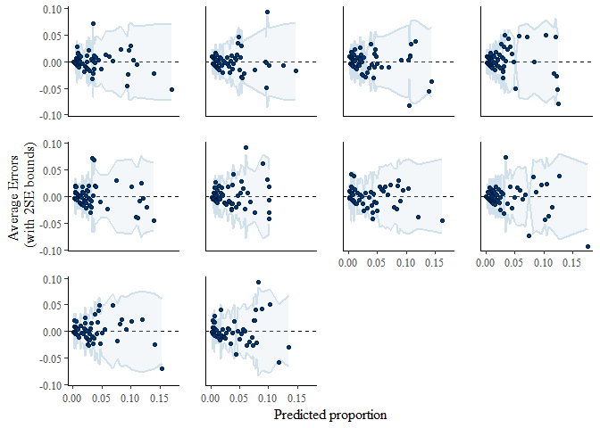<!-- -->
Assess predictive accuracy

``` r
isolatesnarrowallmountainslog10model_pred <- predict(isolatesnarrowallmountainslog10model, type = "response")[, "Estimate"]
isolatesnarrowallmountainslog10model_pred <- as.numeric(isolatesnarrowallmountainslog10model_pred > mean(languagesonlandmasswithmountains$IsolateNarrow))
```

``` r
(classtab_isolatesnarrowallmountainslog10model <- table(predicted = isolatesnarrowallmountainslog10model_pred, observed = languagesonlandmasswithmountains$IsolateNarrow))
```

    ##          observed
    ## predicted FALSE TRUE
    ##         0  4890   40
    ##         1  2049  138

``` r
(acc_isolatesnarrowallmountainslog10model <- sum(diag(classtab_isolatesnarrowallmountainslog10model)) / sum(classtab_isolatesnarrowallmountainslog10model))
```

    ## [1] 0.7064774

## Bernoulli model for isolates in a wide sense and all mountainareas with log10 transformed predictors and random effect for macroarea

``` r
isolatewideallmountainslog10model <- brm(IsolateWide ~ Distancetosealog10 * Distancetomountainlog10 + (1 + (Distancetosealog10 * Distancetomountainlog10) | Macroarea), family = "bernoulli", data = languagesonlandmasswithmountains, warmup = 2000, iter = 3000, chains = 4, prior = priorsmountains, seed = 2102, control = list(adapt_delta = 0.999999, max_treedepth = 20))
```

check Rhat and ESS values

``` r
summary(isolatewideallmountainslog10model)
```

    ##  Family: bernoulli 
    ##   Links: mu = logit 
    ## Formula: IsolateWide ~ Distancetosealog10 * Distancetomountainlog10 + (1 + (Distancetosealog10 * Distancetomountainlog10) | Macroarea) 
    ##    Data: languagesonlandmasswithmountains (Number of observations: 7117) 
    ## Samples: 4 chains, each with iter = 3000; warmup = 2000; thin = 1;
    ##          total post-warmup samples = 4000
    ## 
    ## Group-Level Effects: 
    ## ~Macroarea (Number of levels: 6) 
    ##                                                                         Estimate
    ## sd(Intercept)                                                               2.39
    ## sd(Distancetosealog10)                                                      0.76
    ## sd(Distancetomountainlog10)                                                 0.18
    ## sd(Distancetosealog10:Distancetomountainlog10)                              0.11
    ## cor(Intercept,Distancetosealog10)                                          -0.39
    ## cor(Intercept,Distancetomountainlog10)                                     -0.04
    ## cor(Distancetosealog10,Distancetomountainlog10)                             0.11
    ## cor(Intercept,Distancetosealog10:Distancetomountainlog10)                   0.15
    ## cor(Distancetosealog10,Distancetosealog10:Distancetomountainlog10)         -0.32
    ## cor(Distancetomountainlog10,Distancetosealog10:Distancetomountainlog10)    -0.25
    ##                                                                         Est.Error
    ## sd(Intercept)                                                                0.94
    ## sd(Distancetosealog10)                                                       0.40
    ## sd(Distancetomountainlog10)                                                  0.18
    ## sd(Distancetosealog10:Distancetomountainlog10)                               0.09
    ## cor(Intercept,Distancetosealog10)                                            0.33
    ## cor(Intercept,Distancetomountainlog10)                                       0.43
    ## cor(Distancetosealog10,Distancetomountainlog10)                              0.44
    ## cor(Intercept,Distancetosealog10:Distancetomountainlog10)                    0.39
    ## cor(Distancetosealog10,Distancetosealog10:Distancetomountainlog10)           0.40
    ## cor(Distancetomountainlog10,Distancetosealog10:Distancetomountainlog10)      0.45
    ##                                                                         l-95% CI
    ## sd(Intercept)                                                               1.15
    ## sd(Distancetosealog10)                                                      0.28
    ## sd(Distancetomountainlog10)                                                 0.01
    ## sd(Distancetosealog10:Distancetomountainlog10)                              0.01
    ## cor(Intercept,Distancetosealog10)                                          -0.88
    ## cor(Intercept,Distancetomountainlog10)                                     -0.82
    ## cor(Distancetosealog10,Distancetomountainlog10)                            -0.77
    ## cor(Intercept,Distancetosealog10:Distancetomountainlog10)                  -0.64
    ## cor(Distancetosealog10,Distancetosealog10:Distancetomountainlog10)         -0.91
    ## cor(Distancetomountainlog10,Distancetosealog10:Distancetomountainlog10)    -0.92
    ##                                                                         u-95% CI
    ## sd(Intercept)                                                               4.68
    ## sd(Distancetosealog10)                                                      1.73
    ## sd(Distancetomountainlog10)                                                 0.58
    ## sd(Distancetosealog10:Distancetomountainlog10)                              0.33
    ## cor(Intercept,Distancetosealog10)                                           0.36
    ## cor(Intercept,Distancetomountainlog10)                                      0.75
    ## cor(Distancetosealog10,Distancetomountainlog10)                             0.86
    ## cor(Intercept,Distancetosealog10:Distancetomountainlog10)                   0.82
    ## cor(Distancetosealog10,Distancetosealog10:Distancetomountainlog10)          0.55
    ## cor(Distancetomountainlog10,Distancetosealog10:Distancetomountainlog10)     0.69
    ##                                                                         Rhat
    ## sd(Intercept)                                                           1.00
    ## sd(Distancetosealog10)                                                  1.00
    ## sd(Distancetomountainlog10)                                             1.00
    ## sd(Distancetosealog10:Distancetomountainlog10)                          1.00
    ## cor(Intercept,Distancetosealog10)                                       1.00
    ## cor(Intercept,Distancetomountainlog10)                                  1.00
    ## cor(Distancetosealog10,Distancetomountainlog10)                         1.00
    ## cor(Intercept,Distancetosealog10:Distancetomountainlog10)               1.00
    ## cor(Distancetosealog10,Distancetosealog10:Distancetomountainlog10)      1.00
    ## cor(Distancetomountainlog10,Distancetosealog10:Distancetomountainlog10) 1.00
    ##                                                                         Bulk_ESS
    ## sd(Intercept)                                                               1976
    ## sd(Distancetosealog10)                                                      1516
    ## sd(Distancetomountainlog10)                                                 1223
    ## sd(Distancetosealog10:Distancetomountainlog10)                               962
    ## cor(Intercept,Distancetosealog10)                                           2663
    ## cor(Intercept,Distancetomountainlog10)                                      3669
    ## cor(Distancetosealog10,Distancetomountainlog10)                             3140
    ## cor(Intercept,Distancetosealog10:Distancetomountainlog10)                   2710
    ## cor(Distancetosealog10,Distancetosealog10:Distancetomountainlog10)          2975
    ## cor(Distancetomountainlog10,Distancetosealog10:Distancetomountainlog10)     2162
    ##                                                                         Tail_ESS
    ## sd(Intercept)                                                               2505
    ## sd(Distancetosealog10)                                                      2406
    ## sd(Distancetomountainlog10)                                                 2306
    ## sd(Distancetosealog10:Distancetomountainlog10)                              1696
    ## cor(Intercept,Distancetosealog10)                                           2845
    ## cor(Intercept,Distancetomountainlog10)                                      2467
    ## cor(Distancetosealog10,Distancetomountainlog10)                             2618
    ## cor(Intercept,Distancetosealog10:Distancetomountainlog10)                   2804
    ## cor(Distancetosealog10,Distancetosealog10:Distancetomountainlog10)          2675
    ## cor(Distancetomountainlog10,Distancetosealog10:Distancetomountainlog10)     2850
    ## 
    ## Population-Level Effects: 
    ##                                            Estimate Est.Error l-95% CI u-95% CI
    ## Intercept                                     -3.41      1.09    -5.52    -1.14
    ## Distancetosealog10                             0.07      0.37    -0.62     0.90
    ## Distancetomountainlog10                        0.16      0.17    -0.19     0.48
    ## Distancetosealog10:Distancetomountainlog10    -0.03      0.09    -0.19     0.14
    ##                                            Rhat Bulk_ESS Tail_ESS
    ## Intercept                                  1.00     1139     1490
    ## Distancetosealog10                         1.00     1686     1825
    ## Distancetomountainlog10                    1.00     1863     1805
    ## Distancetosealog10:Distancetomountainlog10 1.00     1751     1549
    ## 
    ## Samples were drawn using sampling(NUTS). For each parameter, Bulk_ESS
    ## and Tail_ESS are effective sample size measures, and Rhat is the potential
    ## scale reduction factor on split chains (at convergence, Rhat = 1).

Inspect chains

``` r
plot(isolatewideallmountainslog10model)
```

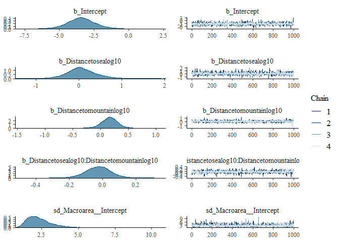<!-- -->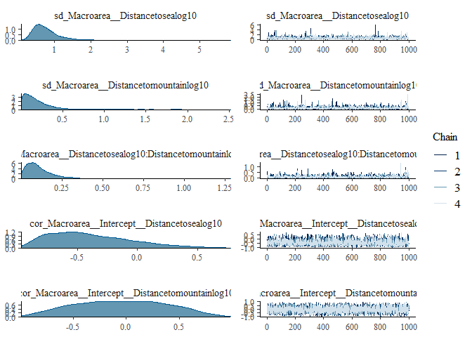<!-- -->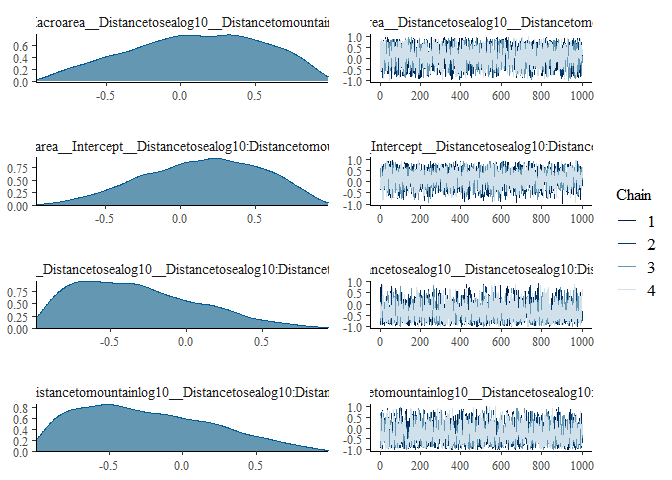<!-- -->
Inspect plots of observed data and posterior predictive samples

``` r
pp_check(isolatewideallmountainslog10model)
```

    ## Using 10 posterior samples for ppc type 'dens_overlay' by default.

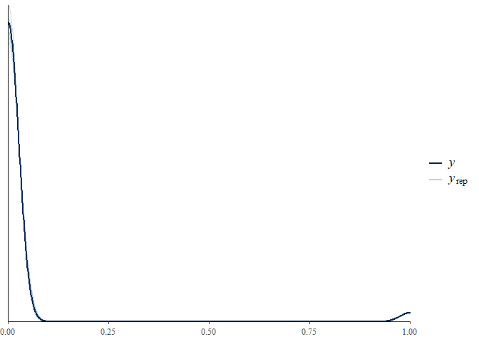<!-- -->

``` r
pp_check(isolatewideallmountainslog10model, type = "error_binned")
```

    ## Using 10 posterior samples for ppc type 'error_binned' by default.

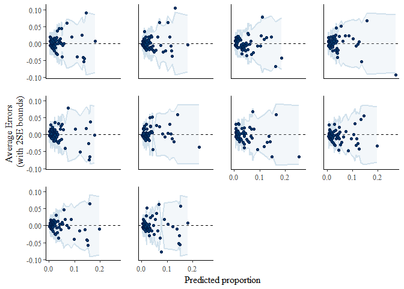<!-- -->

``` r
isolatewideallmountainslog10model_pred <- predict(isolatewideallmountainslog10model, type = "response")[, "Estimate"]
isolatewideallmountainslog10model_pred <- as.numeric(isolatewideallmountainslog10model_pred > mean(languagesonlandmasswithmountains$IsolateWide))
```

``` r
(classtab_isolatewideallmountainslog10model <- table(predicted = isolatewideallmountainslog10model_pred, observed = languagesonlandmasswithmountains$IsolateWide))
```

    ##          observed
    ## predicted FALSE TRUE
    ##         0  5169   56
    ##         1  1736  156

``` r
(acc_isolatewideallmountainslog10model <- sum(diag(classtab_isolatewideallmountainslog10model)) / sum(classtab_isolatewideallmountainslog10model))
```

    ## [1] 0.7482085

## Finally, we run a model with the specifications as in the main analysis (i.e. isolates in a narrow sense and high mountain areas with log10 transformed predictors and random effect for macroarea), but this time retaining the “Papunesia” macro-area as a level in the random effects structure

Load in datasets again

``` r
languagesonlandmasswithmountains <- read.csv("../Data/languagesonlandmasswithmountains.csv", header = T, encoding = "UTF-8")
languagesonlandmasswithhighmountains <- read.csv("../Data/languagesonlandmasswithhighmountains.csv", header = T, encoding = "UTF-8")
```

Treat Macroareas as factors again

``` r
languagesonlandmasswithmountains$Macroarea <- as.factor(languagesonlandmasswithmountains$Macroarea)
languagesonlandmasswithhighmountains$Macroarea <- as.factor(languagesonlandmasswithhighmountains$Macroarea)
```

Log 10 transform of predictors after adding a constant to reduce skew
again

``` r
languagesonlandmasswithmountains <- mutate(languagesonlandmasswithmountains, Family_ID = ifelse(Family_ID == "", Name, Family_ID))
languagesonlandmasswithmountains <- mutate(languagesonlandmasswithmountains, Distancetosealog10 = log10(Distancetosea + 0.001))
languagesonlandmasswithmountains <- mutate(languagesonlandmasswithmountains, Distancetomountainlog10 = log10(Distancetomountain + 0.001))

languagesonlandmasswithhighmountains <- mutate(languagesonlandmasswithhighmountains, Family_ID = ifelse(Family_ID == "", Name, Family_ID))
languagesonlandmasswithhighmountains <- mutate(languagesonlandmasswithhighmountains, Distancetosealog10 = log10(Distancetosea + 0.001))
languagesonlandmasswithhighmountains <- mutate(languagesonlandmasswithhighmountains, Distancetohighmountainlog10 = log10(Distancetohighmountain + 0.001))
```

``` r
isolatesnarrowhighmountainslog10model_withpapunesia <- brm(IsolateNarrow ~ Distancetosealog10 * Distancetohighmountainlog10 + (1 + (Distancetosealog10 * Distancetohighmountainlog10) | Macroarea), family = "bernoulli", data = languagesonlandmasswithhighmountains, warmup = 2000, iter = 3000, chains = 4, prior = priorshighmountains, seed = 189, control = list(adapt_delta = 0.999999, max_treedepth = 20))
```

Model assessment and checks

check Rhat and ESS values

``` r
summary(isolatesnarrowhighmountainslog10model_withpapunesia)
```

    ##  Family: bernoulli 
    ##   Links: mu = logit 
    ## Formula: IsolateNarrow ~ Distancetosealog10 * Distancetohighmountainlog10 + (1 + (Distancetosealog10 * Distancetohighmountainlog10) | Macroarea) 
    ##    Data: languagesonlandmasswithhighmountains (Number of observations: 5251) 
    ## Samples: 4 chains, each with iter = 3000; warmup = 2000; thin = 1;
    ##          total post-warmup samples = 4000
    ## 
    ## Group-Level Effects: 
    ## ~Macroarea (Number of levels: 5) 
    ##                                                                                 Estimate
    ## sd(Intercept)                                                                       2.06
    ## sd(Distancetosealog10)                                                              0.57
    ## sd(Distancetohighmountainlog10)                                                     0.37
    ## sd(Distancetosealog10:Distancetohighmountainlog10)                                  0.13
    ## cor(Intercept,Distancetosealog10)                                                  -0.08
    ## cor(Intercept,Distancetohighmountainlog10)                                          0.12
    ## cor(Distancetosealog10,Distancetohighmountainlog10)                                -0.03
    ## cor(Intercept,Distancetosealog10:Distancetohighmountainlog10)                      -0.04
    ## cor(Distancetosealog10,Distancetosealog10:Distancetohighmountainlog10)             -0.01
    ## cor(Distancetohighmountainlog10,Distancetosealog10:Distancetohighmountainlog10)    -0.17
    ##                                                                                 Est.Error
    ## sd(Intercept)                                                                        1.23
    ## sd(Distancetosealog10)                                                               0.55
    ## sd(Distancetohighmountainlog10)                                                      0.43
    ## sd(Distancetosealog10:Distancetohighmountainlog10)                                   0.17
    ## cor(Intercept,Distancetosealog10)                                                    0.44
    ## cor(Intercept,Distancetohighmountainlog10)                                           0.43
    ## cor(Distancetosealog10,Distancetohighmountainlog10)                                  0.46
    ## cor(Intercept,Distancetosealog10:Distancetohighmountainlog10)                        0.44
    ## cor(Distancetosealog10,Distancetosealog10:Distancetohighmountainlog10)               0.46
    ## cor(Distancetohighmountainlog10,Distancetosealog10:Distancetohighmountainlog10)      0.46
    ##                                                                                 l-95% CI
    ## sd(Intercept)                                                                       0.39
    ## sd(Distancetosealog10)                                                              0.02
    ## sd(Distancetohighmountainlog10)                                                     0.01
    ## sd(Distancetosealog10:Distancetohighmountainlog10)                                  0.00
    ## cor(Intercept,Distancetosealog10)                                                  -0.83
    ## cor(Intercept,Distancetohighmountainlog10)                                         -0.72
    ## cor(Distancetosealog10,Distancetohighmountainlog10)                                -0.85
    ## cor(Intercept,Distancetosealog10:Distancetohighmountainlog10)                      -0.81
    ## cor(Distancetosealog10,Distancetosealog10:Distancetohighmountainlog10)             -0.83
    ## cor(Distancetohighmountainlog10,Distancetosealog10:Distancetohighmountainlog10)    -0.91
    ##                                                                                 u-95% CI
    ## sd(Intercept)                                                                       5.07
    ## sd(Distancetosealog10)                                                              2.08
    ## sd(Distancetohighmountainlog10)                                                     1.58
    ## sd(Distancetosealog10:Distancetohighmountainlog10)                                  0.61
    ## cor(Intercept,Distancetosealog10)                                                   0.77
    ## cor(Intercept,Distancetohighmountainlog10)                                          0.85
    ## cor(Distancetosealog10,Distancetohighmountainlog10)                                 0.81
    ## cor(Intercept,Distancetosealog10:Distancetohighmountainlog10)                       0.78
    ## cor(Distancetosealog10,Distancetosealog10:Distancetohighmountainlog10)              0.83
    ## cor(Distancetohighmountainlog10,Distancetosealog10:Distancetohighmountainlog10)     0.72
    ##                                                                                 Rhat
    ## sd(Intercept)                                                                   1.00
    ## sd(Distancetosealog10)                                                          1.00
    ## sd(Distancetohighmountainlog10)                                                 1.00
    ## sd(Distancetosealog10:Distancetohighmountainlog10)                              1.00
    ## cor(Intercept,Distancetosealog10)                                               1.00
    ## cor(Intercept,Distancetohighmountainlog10)                                      1.00
    ## cor(Distancetosealog10,Distancetohighmountainlog10)                             1.00
    ## cor(Intercept,Distancetosealog10:Distancetohighmountainlog10)                   1.00
    ## cor(Distancetosealog10,Distancetosealog10:Distancetohighmountainlog10)          1.00
    ## cor(Distancetohighmountainlog10,Distancetosealog10:Distancetohighmountainlog10) 1.00
    ##                                                                                 Bulk_ESS
    ## sd(Intercept)                                                                       2205
    ## sd(Distancetosealog10)                                                              1402
    ## sd(Distancetohighmountainlog10)                                                      985
    ## sd(Distancetosealog10:Distancetohighmountainlog10)                                  1165
    ## cor(Intercept,Distancetosealog10)                                                   4342
    ## cor(Intercept,Distancetohighmountainlog10)                                          4285
    ## cor(Distancetosealog10,Distancetohighmountainlog10)                                 3513
    ## cor(Intercept,Distancetosealog10:Distancetohighmountainlog10)                       4412
    ## cor(Distancetosealog10,Distancetosealog10:Distancetohighmountainlog10)              4113
    ## cor(Distancetohighmountainlog10,Distancetosealog10:Distancetohighmountainlog10)     2931
    ##                                                                                 Tail_ESS
    ## sd(Intercept)                                                                       1532
    ## sd(Distancetosealog10)                                                              1811
    ## sd(Distancetohighmountainlog10)                                                     1750
    ## sd(Distancetosealog10:Distancetohighmountainlog10)                                  1283
    ## cor(Intercept,Distancetosealog10)                                                   2983
    ## cor(Intercept,Distancetohighmountainlog10)                                          2988
    ## cor(Distancetosealog10,Distancetohighmountainlog10)                                 3084
    ## cor(Intercept,Distancetosealog10:Distancetohighmountainlog10)                       3083
    ## cor(Distancetosealog10,Distancetosealog10:Distancetohighmountainlog10)              3225
    ## cor(Distancetohighmountainlog10,Distancetosealog10:Distancetohighmountainlog10)     3004
    ## 
    ## Population-Level Effects: 
    ##                                                Estimate Est.Error l-95% CI
    ## Intercept                                         -3.17      1.24    -5.76
    ## Distancetosealog10                                -0.02      0.44    -0.78
    ## Distancetohighmountainlog10                       -0.15      0.30    -0.76
    ## Distancetosealog10:Distancetohighmountainlog10     0.04      0.13    -0.18
    ##                                                u-95% CI Rhat Bulk_ESS Tail_ESS
    ## Intercept                                         -0.66 1.00     2098     2332
    ## Distancetosealog10                                 1.01 1.00     1861     1520
    ## Distancetohighmountainlog10                        0.42 1.00     1948     1606
    ## Distancetosealog10:Distancetohighmountainlog10     0.32 1.00     1786     1004
    ## 
    ## Samples were drawn using sampling(NUTS). For each parameter, Bulk_ESS
    ## and Tail_ESS are effective sample size measures, and Rhat is the potential
    ## scale reduction factor on split chains (at convergence, Rhat = 1).

Inspect chains

``` r
plot(isolatesnarrowhighmountainslog10model_withpapunesia)
```

<!-- --><!-- --><!-- -->
Inspect plots of observed data and posterior predictive samples

``` r
pp_check(isolatesnarrowhighmountainslog10model_withpapunesia)
```

    ## Using 10 posterior samples for ppc type 'dens_overlay' by default.

<!-- -->

``` r
pp_check(isolatesnarrowhighmountainslog10model_withpapunesia, type = "error_binned")
```

    ## Using 10 posterior samples for ppc type 'error_binned' by default.

<!-- -->
Assess predictive accuracy

``` r
isolatesnarrowhighmountainslog10model_withpapunesia_pred <- predict(isolatesnarrowhighmountainslog10model_withpapunesia, type = "response")[, "Estimate"]
isolatesnarrowhighmountainslog10model_withpapunesia_pred <- as.numeric(isolatesnarrowhighmountainslog10model_withpapunesia_pred > mean(languagesonlandmasswithhighmountains$IsolateNarrow))
```

``` r
(classtab_isolatesnarrowhighmountainslog10model_withpapunesia <- table(predicted = isolatesnarrowhighmountainslog10model_withpapunesia_pred, observed = languagesonlandmasswithhighmountains$IsolateNarrow))
```

    ##          observed
    ## predicted FALSE TRUE
    ##         0  3911   27
    ##         1  1219   94

``` r
(acc_isolatesnarrowhighmountainslog10model_withpapunesia <- sum(diag(classtab_isolatesnarrowhighmountainslog10model_withpapunesia)) / sum(classtab_isolatesnarrowhighmountainslog10model_withpapunesia))
```

    ## [1] 0.7627119
